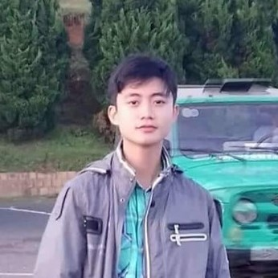

<!-- | - |-| -|
| <a href="https://github.com/quoccuonglqd" rel="alternate" style="color: #DC143C"><i class="fa fa-github fa-2x"></i> Github</a>      | <a href="https://www.linkedin.com/in/quoc-cuong-nguyen-076b91192/" rel="alternate" style="color: #DC143C"><i class="fa fa-linkedin-square fa-2x"></i> Linkedin</a> | <a href="{{ https://www.facebook.com/profile.php?id=100007138727104 }}" rel="alternate" style="color: #DC143C"><i class="fa fa-facebook-square fa-2x"></i> Facebook</a> | -->

<table style="width:50%">
  <tr>
    <td><a href="https://github.com/quoccuonglqd" rel="alternate" style="color: #DC143C"><i class="fa fa-github fa-2x"></i> Github</a></td>
    <td><a href="https://www.linkedin.com/in/quoc-cuong-nguyen-076b91192/" rel="alternate" style="color: #DC143C"><i class="fa fa-linkedin-square fa-2x"></i> Linkedin</a></td>
    <td><a href="{{ https://www.facebook.com/profile.php?id=100007138727104 }}" rel="alternate" style="color: #DC143C"><i class="fa fa-facebook-square fa-2x"></i> Facebook</a></td>
  </tr>
</table>

<nav class="site-state">
  <!-- 

    

      

          <a href="https://github.com/quoccuonglqd" rel="alternate" style="color: #DC143C">
            <i class="fa fa-github fa-2x"></i> 
            Github
          </a>
      

      

          <a href="https://www.linkedin.com/in/quoc-cuong-nguyen-076b91192/" rel="alternate" style="color: #DC143C">
            <i class="fa fa-linkedin-square fa-2x"></i> 
            Linkedin
          </a>
      

      

          <a href="{{ https://www.facebook.com/profile.php?id=100007138727104 }}" rel="alternate" style="color: #DC143C">
            <i class="fa fa-facebook-square fa-2x"></i> 
            Facebook
          </a>
      

    

  
 -->

  

  <!-- 

      <a href="{{ site.url }}/assets/CV.pdf" rel="alternate" style="color: #DC143C">
        <i class="fa fa-file fa-2x"></i> 
        CV
      </a>
  
 -->

  

</nav>

### Profile :
[Present] 
Honor Program in Computer Science, <a href="https://www.uit.edu.vn/" target="_blank">UIT-VNU.</a> 

### Interests : 
Machine Learning, Deep Learning, Computer Vision, Data Science

### Projects:
- ID Card Digitization and Information Extraction
	- Examined to use CRAFT, PIXELLINK, CTPN for text detection module and VIETOCR for text recognition module
	- Created synthetic data for ID card images
	- Built a post processing module based on database retrieval to correct text error
	- Designed a web service to deploy the service

- Script Identification in the wild(SIW2021) - ICDAR2021(A - Rank Conference)
	- Developed EfficientNet B7 for a competive solution
	- Ranked top 4 in the final leader board and become co-author in the associated conference paper in ICDAR 2021
- Abdominal Multi Organ Segmentation (FLARE2021) - MICCAI2021(A - Rank Conference)
	- Presented an approach based on 2D segmentation
	- Exploit model optimization techniques in Pytorch to optimize infernece speed and GPU memory
	- Ranked top 6 in the final leader board and made an oral presentation in the satteline event of MICCAI conference
- Vehicle Counting - Ho Chi Minh City AI-Challenge 2020
	- Designed a solution using Detectron2, DeepSort
	- Ranked top 18/217 in the final leader boardTraffic Sign Detection - Zalo AI Challenge 2020
	- Designed a solution using Detectron2
	- Ranked top 17 in the final leader board and get Honorable Mention Award
- Smart Citizens for Smart Cities - AI Hackathon 2020 @ AI4VN
	- Creative Ideas Award
	- Honorable Mention Award
	- Awarded for the fastest and most efficient submit(3/10 submits)
- Generative Adversarial Networks for Photo Cartoonization
	- Build an Style Tranfer network for photo cartoonization
	- Deploy the model into a mobile app
- Landmark Retrieval
	- Experiment the performance of many Deep Leaning based feature extractors
	- Study the use of DELG model for the retrieval problem
	- Deploy a web application that can search for related image as well as their location information based on an inputimage
- View Synthesis
	- Study the use of NERF model
	- Finish the completed pipeline for data formatting and model retraining

### Publications:
- Das, A., Ferrer, M. A., Morales, A., Diaz, M., Pal, U., Impedovo, D., ... & Gattal, A. (2021, September). ICDAR 2021 Competition on Script Identification in the Wild. In International Conference on Document Analysis and Recognition (pp. 738-753). Springer, Cham.

### Contact :
E-mail : 
18520206@gm.uit.edu.vn 
<!--  -->