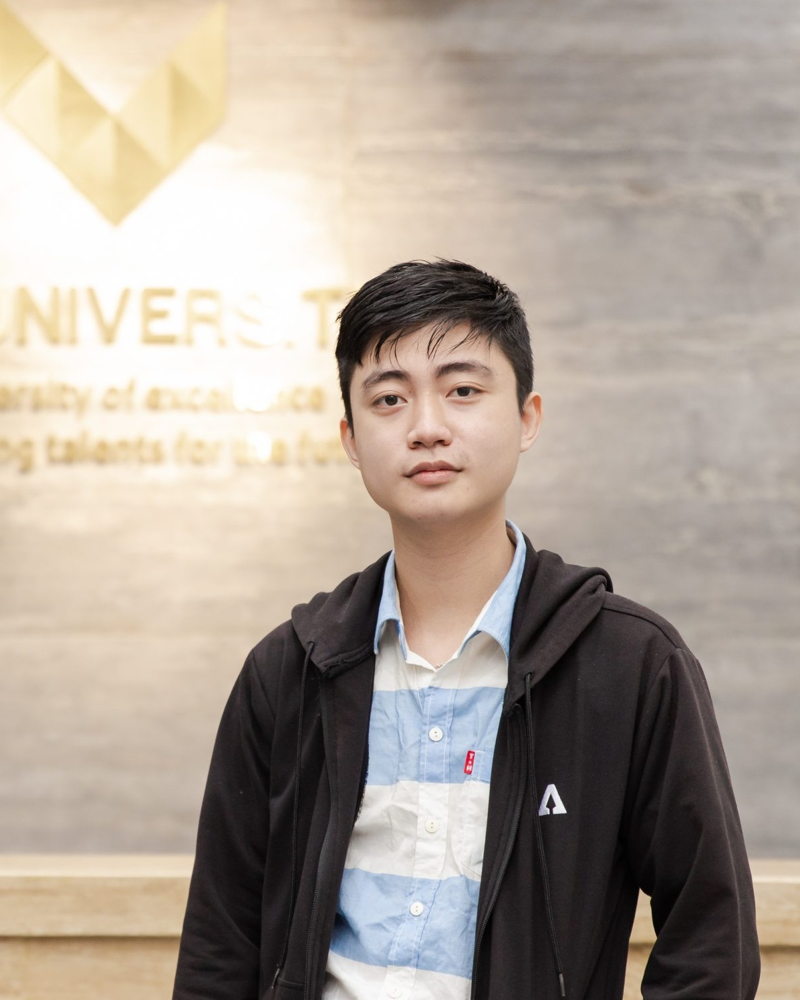

<!-- | - |-| -|
| <a href="https://github.com/quoccuonglqd" rel="alternate" style="color: #DC143C"><i class="fa fa-github fa-2x"></i> Github</a>      | <a href="https://www.linkedin.com/in/quoc-cuong-nguyen-076b91192/" rel="alternate" style="color: #DC143C"><i class="fa fa-linkedin-square fa-2x"></i> Linkedin</a> | <a href="{{ https://www.facebook.com/profile.php?id=100007138727104 }}" rel="alternate" style="color: #DC143C"><i class="fa fa-facebook-square fa-2x"></i> Facebook</a> | -->

<table style="width:50%">
  <tr>
    <td><a href="https://github.com/quoccuonglqd" rel="alternate" style="color: #DC143C"><i class="fa fa-github fa-2x"></i> Github</a></td>
    <td><a href="https://www.linkedin.com/in/quoc-cuong-nguyen-076b91192/" rel="alternate" style="color: #DC143C"><i class="fa fa-linkedin-square fa-2x"></i> Linkedin</a></td>
    <td><a href="https://www.facebook.com/profile.php?id=100007138727104" rel="alternate" style="color: #DC143C"><i class="fa fa-facebook-square fa-2x"></i> Facebook</a></td>
    <td><a href="https://scholar.google.com/citations?user=0r-BDaAAAAAJ&hl=en" rel="alternate" style="color: #DC143C"><i class="fa fa-graduation-cap fa-2x"></i> Google Scholar</a></td>
  </tr>
</table>

<nav class="site-state">
  <!-- 

    

      

          <a href="https://github.com/quoccuonglqd" rel="alternate" style="color: #DC143C">
            <i class="fa fa-github fa-2x"></i> 
            Github
          </a>
      

      

          <a href="https://www.linkedin.com/in/quoc-cuong-nguyen-076b91192/" rel="alternate" style="color: #DC143C">
            <i class="fa fa-linkedin-square fa-2x"></i> 
            Linkedin
          </a>
      

      

          <a href="{{ https://www.facebook.com/profile.php?id=100007138727104 }}" rel="alternate" style="color: #DC143C">
            <i class="fa fa-facebook-square fa-2x"></i> 
            Facebook
          </a>
      

    

  
 -->

  

  <!-- 

      <a href="{{ site.url }}/assets/CV.pdf" rel="alternate" style="color: #DC143C">
        <i class="fa fa-file fa-2x"></i> 
        CV
      </a>
  
 -->

  

</nav>

### Educational background :
Honor Program in Computer Science, <a href="https://www.uit.edu.vn/" target="_blank">UIT-VNU.</a> 
Master of Information Science, <a href="https://www.jaist.ac.jp/" target="_blank">JAIST.</a> 

<!-- ### Interests : 
Machine Learning, Deep Learning, Computer Vision, Data Science -->

### Industry Experience: 
- March. 2024 - Now: MLOps Engineer, AI Team Lead at IMT Solutions
- December. 2022 - March. 2024: AI Engineer at Bap IT 
- Aug. 2022 - Dec.2022: AI Backend Engineer at PapaGroup

### ACADEMIC EXPERIENCE:
- April. 2024 - Now: Labratory Assistant at Japan Adavanced Institute of Science and Technology
- Feb. 2022 - Aug. 2022: Research Assistant at Vin Smart Health Center
- Sep. 2018 - Jan. 2022: Research Assistant at Multimedia Communication Lab at the University of Information Technology

### FREELANCE EXPERIENCE:
- June. 2023 - May. 2024: Data Engineer, LLM Engineer at ChatFly

### Projects:
- General Document Analysis
  - Facilitated the CI/CD process for data ingestion, annotation, model training, model deployment, monitoring, and AI
API development for open-sourced layout analysis model 
  - Setup pipeline to allow user finetune their own Azure Document Intelligence model
  - Apply this workflow to build:
    - Invoice information extraction
    - Name card information extraction
    - Resume analyzer application

- LLM-based chatbot framework
  - Employs cutting-edge techniques: Qdrant, Semantic Caching, Semantic Routing, NVIDIA Memo, Portkey
  - Support including references and images in the response of chatbot
  - Apply this framework to build:
    - An internal chatbot to support newly hired employees.
    - A chatbot capable of translating receipt names across a set of low-resourced languages

- IoT data management
  - Developed AWS architecture to monitor the data from IOT sensor devices which measures temperature, humidity, power usage, etc
  - Used AWS service to build machine learning pipeline used to forecast the time series value in the future as well as detect
anomalies in the previous month's data

- AI camera system for face recognition 
  - Developed and maintained AI services of real-time recognition and authentication of individuals.
  - Integrate into the check-in/check-out system

- ID Card Digitization and Information Extraction
	- Examined to use CRAFT, PIXELLINK, CTPN for text detection module and VIETOCR for text recognition module
	- Created synthetic data for ID card images
	- Built a post processing module based on database retrieval to correct text error
	- Designed a web service to deploy the service

- Script Identification in the wild(SIW2021) - ICDAR2021(A - Rank Conference)
	- Developed EfficientNet B7 for a competive solution
	- Ranked top 4 in the final leader board and become co-author in the associated conference paper in ICDAR 2021
- Abdominal Multi Organ Segmentation (FLARE2021) - MICCAI2021(A - Rank Conference)
	- Presented an approach based on 2D segmentation
	- Exploit model optimization techniques in Pytorch to optimize infernece speed and GPU memory
	- Ranked top 6 in the final leader board and made an oral presentation in the satteline event of MICCAI conference
- Vehicle Counting - Ho Chi Minh City AI-Challenge 2020
	- Designed a solution using Detectron2, DeepSort
	- Ranked top 18/217 in the final leader boardTraffic Sign Detection - Zalo AI Challenge 2020
	- Designed a solution using Detectron2
	- Ranked top 17 in the final leader board and get Honorable Mention Award
- Smart Citizens for Smart Cities - AI Hackathon 2020 @ AI4VN
	- Creative Ideas Award
	- Honorable Mention Award
	- Awarded for the fastest and most efficient submit(3/10 submits)
- Generative Adversarial Networks for Photo Cartoonization
	- Build an Style Tranfer network for photo cartoonization
	- Deploy the model into a mobile app
- Landmark Retrieval
	- Experiment the performance of many Deep Leaning based feature extractors
	- Study the use of DELG model for the retrieval problem
	- Deploy a web application that can search for related image as well as their location information based on an inputimage
- View Synthesis
	- Study the use of NERF model
	- Finish the completed pipeline for data formatting and model retraining

### Publications:
- Nguyen, Quoc-Cuong, et al. "Efficient Multi-Organ Segmentation Using HRNet And OCRNet." 2022 RIVF International Conference on Computing and Communication Technologies (RIVF). IEEE, 2022.

- Nguyen, Huy Q., et al. "Enhancing few-shot image classification with cosine transformer." IEEE Access (2023).

- Das, A., Ferrer, M. A., Morales, A., Diaz, M., Pal, U., Impedovo, D., ... & Gattal, A. (2021, September). ICDAR 2021 Competition on Script Identification in the Wild. In International Conference on Document Analysis and Recognition (pp. 738-753). Springer, Cham.

- MA, Jun, et al. Fast and low-GPU-memory abdomen CT organ segmentation: the flare challenge. Medical Image Analysis, 2022, 82: 102616.

### Award:

• Vietnam Southern Provicial Programming Contest, HCM, VN  
• Third Prize in 2018 Vietnam National Programming Contest  
• Honorable Mention in 2018 ICPC Asia Southeast and Pacific Hanoi Regional Contest  
• Second Prize in 2019 Vietnam National Programming Contest  
• First Prize in 2019 UIT ACM Programming Contest  
• Honorable Mention in 2020 ICPC Asia Can Tho Regional Contest  
• Third Prize in Vietnam Informatic Student Olypic 2018  
• Top 4 in ICDAR Competition on Script Identification in the Wild  
• Top 6 in FLARE2021-Fast and Low GPU memory Abdominal oRgan sEgmentation  
• Hornorable Mention in Computer Vision Track of Zalo AI Challenge 2020  
• AI Hackathon 2020 @ AI4VN  
• Creative Ideas Award  
• Honorable Mention Award  
• Awarded for the fastest and most efficient submit(3/10 submits)  
• First Prize in Competitive Programming Competition with NetCompany

### Certification :

• <a href="https://www.credly.com/badges/59d93e8b-15c0-4e62-92d8-018c9677f679" target="_blank"> AWS Solution Architect Associate C03 </a>

• <a href="https://www.datacamp.com/certificate/DSA0019587962979" target="_blank"> Datacamp Data Scientist Associate </a>

• <a href="https://www.coursera.org/account/accomplishments/professional-cert/2JU8MAC9P92T?utm_source=link&utm_medium=certificate&utm_content=cert_image&utm_campaign=sharing_cta&utm_product=prof" target="_blank"> IBM Data Science Professional Certificate </a>

### Contact :
E-mail: quoccuonglqd123@gm.uit.edu.vn

Tel: +84 968543031
<!--  -->