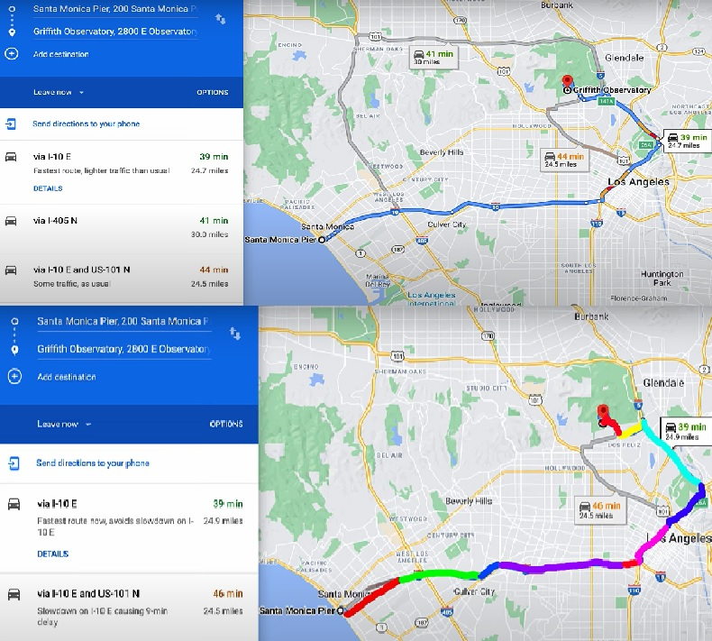
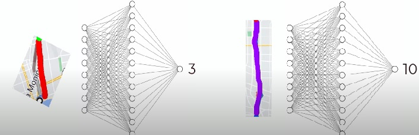
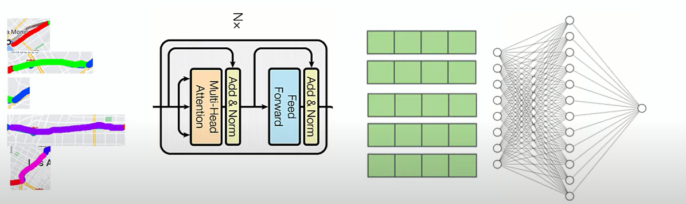
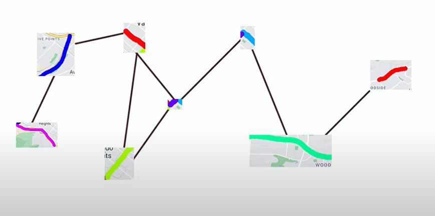
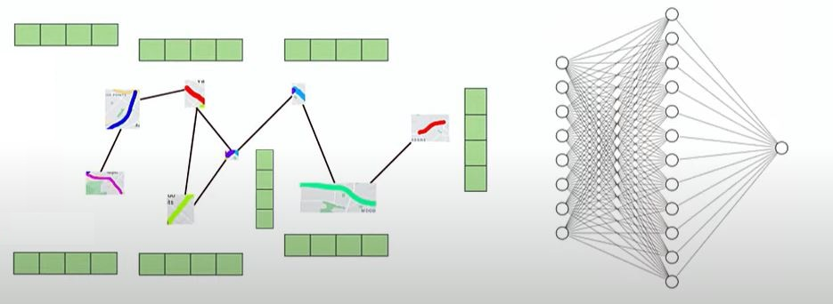

# 1/ Bài toán:
Các ứng dụng bản đồ trực tuyến là một trong những ứng dụng rất thành công của công nghệ thông tin vào đời sống. Có thể nói thành công lớn nhất chính là thu hẹp những rào cản trong việc di chuyển của con người khi cho phép chúng ta tra cứu thông tin bản đồ, định vị vị trí, hướng dẫn lộ trình và thậm chí ... ước lượng giúp cả thời gian di chuyển.

Trong số các tiện ích kể trên, tính toán thời gian cần thiết để di chuyển là một tính năng khá đặc sắc. Bởi lẽ có rất nhiều yếu tố sẽ gây ảnh hưởng đến thời gian di chuyển, việc tổng hợp các dữ liệu này sẽ rất phức tạp. Người ta có thể đã phải thu thập thông tin về độ dài, khả năng xảy ra kẹt xe, chất lượng mặt đường, ..., cập nhật liên tục sau đó tìm cách tổng hợp tất cả thông tin này - 1 quá trình không tưởng. Và đây là lúc AI, cụ thể là Machine Learning, tỏa sáng. Bài viết này sẽ tìm hiểu cách các kỹ sư DeepMind đã xây dựng tính năng ước đoán thời gian di chuyển trên Google Map - ứng dụng bản đồ nổi tiếng bậc nhất.

# 2/ Ý tưởng:

Có rất nhiều địa điểm được hiển thị trên bản đồ, với mỗi đoạn đường nối liền 2 địa điểm sẽ có rất nhiều đoạn đường cần tính toán. Ngoài ra, việc tính trực tiếp 1 đoạn đường dài cũng là 1 vấn đề khó giải quyết. Để đơn giản hóa quá trình này, giải thuật chia để trị đã được ứng dụng. Giải thuật được thực hiện bằng cách định nghĩa 1 tập các đoạn đường ngắn hơn (đoạn đường cơ sở) sao cho ta có thể biểu diễn các tuyến đường lớn hơn như 1 chuỗi liên tiếp một số tuyến ngắn này. Bài toán giờ đây có thể giải quyết thông qua ước lượng cho từng đoạn đường cơ sở và tính tổng kết quả các đoạn đường thành phần của tuyến đường quan tâm. 

**Hình 1** Minh họa tuyến đường từ  Santa Monica Pier đến Grifith Observatory.[Source]('https://www.youtube.com/watch?v=EGPJF-tqbwE&t=15s')

*Note:* Trong các hình minh họa, đầu vào của mô hình được biểu diễn bằng các hình ảnh các đoạn đường cơ sở. Trên thực tế, mỗi đoạn đường cơ sở sẽ tương ứng với các thông tin về điều kiện giao thông trên live tracking và những thông tin này mới là dầu vào cho mô hình. 

#### a/ Feed Forward Network:

Mô hình đơn giản nhất có thể áp dụng là dùng 1 Feed Forward Network để tính toán giá trị thời gian. Cách làm này có một nhược điểm là không xét được mối tương quan giữa các tuyến đường cơ sở. Bởi lẽ đặc điểm của mô hình này là các mẫu dữ liệu được học tách biệt với nhau.

**Hình 2** Feed Forward Network.[Source]('https://www.youtube.com/watch?v=EGPJF-tqbwE&t=15s')

#### b/ Các kiến trúc hồi quy và Transformer

Để khắc phục hạn chế của mạng Feed Forward, một ý tưởng dễ nghĩ đến nhất là các mô hình mạng hồi quy. Các mô hình này ban đầu được đề xuất nhằm mô hình hóa tương quan giữa các từ trong 1 câu text, về sau được mở rộng sang mối quan hệ giữa các frame trong video, các lớp cắt trong ảnh y khoa, ... Ở đây, các thông tin giao thông cũng có thể đóng vai trò đầu vào cho mạng hồi quy. 

Lý thuyết mạng hồi quy đã liên tục được cải tiến theo thời gian và đỉnh điểm là sự ra đời của mô hình Transformer - một mô hình đã thoát ra khỏi cấu trúc chung của RNN. Transformer có thể mô hình nhiều loại hình tương quan giữa toàn bộ các thành phần với cơ chế Multi-Head Attention.

**Hình 3** Transformer Encoder + Feed Forward.[Source]('https://www.youtube.com/watch?v=EGPJF-tqbwE&t=15s')

Thực tế chưa có công trình nào ứng dụng Transformer cho bài toán này. Để có thể đạt độ chính xác tốt, Transformer cần phải học được quan hệ giữa tất cả các thành phần cơ sở. Mặc dù có thể chia nhỏ tập hợp các thành phần cơ sở thành các nhóm nhỏ, việc huấn luyện mô hình Transformer vẫn sẽ đòi hỏi nhiều khả năng tính toán, dữ liệu cũng như tài nguyên. Đây có thể là lý do mà Transformer vẫn không được xem là một giải pháp hứa hẹn.

#### c/ Graph Neural Network

Hạn chế về khối lượng tính toán của Transformer cơ bản là bởi mô hình này xem xét toàn bộ các liên hệ giữa các thành phần cơ sở cùng lúc. Trong bài toán ước lượng thời gian di chuyển, có một nhận xét quan trọng là các đoạn cơ sở nằm cách xa nhau thì mối liên hệ cũng yếu đi. Lợi dụng đặc tính này, người ta đã thử nghiệm một mô hình mới - Graph Neural Network (GNN). 

GNN xây dựng đặc trưng cho các đối tượng thông qua cơ chế đồ thị bao gồm các đỉnh và cạnh. Trong bài toán này, ta có thể xem mỗi đoạn cơ sở là nút và 1 cạnh được tạo ra giữa 2 đoạn cơ sở liền kề. 

Joshi trong [bài viết](https://thegradient.pub/transformers-are-graph-neural-networks/) của mình đã trình bày quan điểm Transformer thực chất có thể xem như một trường hợp đặc biệt của GNN. Transformer có thể xem như mô hình GNN với một đồ thị đầy đủ.

**Hình 4** Biểu diễn liên hệ giữa các thành phần cơ sở dưới dạng đồ thị.[Source]('https://www.youtube.com/watch?v=EGPJF-tqbwE&t=15s')

Sau khi huấn luyện mô hình GNN, ta thu được đặc trưng biểu diễn cho từng đoạn đường. Đặc trưng này sau đó có thể sử dụng làm đầu vào cho mạng Feed Forward Network để dự đoán thời gian di chuyển.

**Hình 5** Tổng quan ý tưởng sử dụng GNN + Feed Forward Net.[Source]('https://www.youtube.com/watch?v=EGPJF-tqbwE&t=15s')

# Tham khảo

- CodeEmporium. (2021, May 17). Breaking down Google Maps with Neural Networks! [Video]. YouTube. https://www.youtube.com/watch?v=EGPJF-tqbwE&t=150s
- Microsoft Research. (2020, May 9). An Introduction to Graph Neural Networks: Models and Applications [Video]. YouTube. https://www.youtube.com/watch?v=zCEYiCxrL_0)
- Chaitanya K. Joshi, "Transformers are Graph Neural Networks", The Gradient, 2020.
- O.L.L.P. (2020, September 3). Traffic prediction with advanced Graph Neural Networks. Blog. https://deepmind.com/blog/article/traffic-prediction-with-advanced-graph-neural-networks