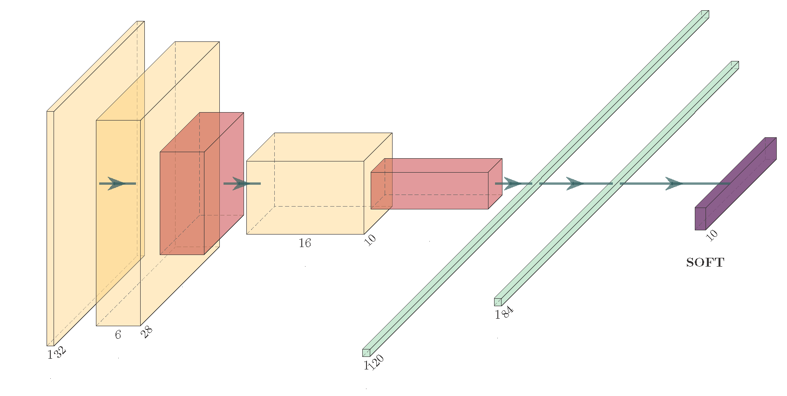
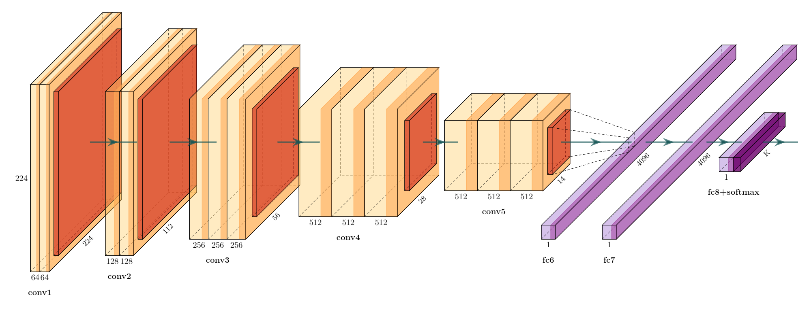
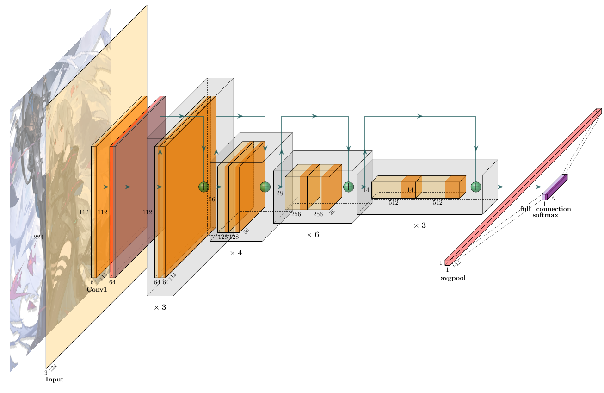
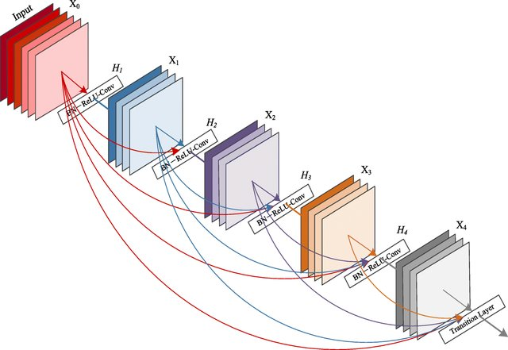
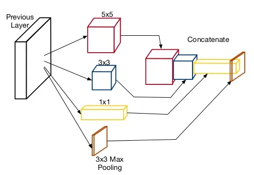

# 1/ Introduction:

Hello and welcome to my blog post on famous variants of convolutional neural networks (CNNs)! If you're reading this, chances are you're just as passionate about deep learning and computer vision as I am. CNNs are an integral part of the field, and have been responsible for some of the most impressive breakthroughs in image classification and object recognition. In this post, I'll be introducing you to some of the most famous CNNs that have been developed over the years and discussing their unique characteristics and contributions to the field. Whether you're a seasoned deep learning practitioner or just starting out, I hope this post will inspire you to dive deeper into the world of CNNs and learn more about how they work. So without further ado, let's get started!

# 2/ Famous network:

## 2.1/ LeNet:

LeNet is a convolutional neural network (CNN) that was developed by Yann LeCun in the 1990s. It was one of the first CNNs and is often considered the "hello world" of CNNs. LeNet was designed to recognize handwritten digits and was widely used for this purpose. It was also used for character recognition and face detection, among other applications.

LeNet consists of a series of convolutional and max-pooling layers, followed by a series of fully connected (dense) layers. It uses a combination of local and global features to recognize patterns in the input data. The local features are learned by the convolutional layers, which apply a set of filters to the input data and detect patterns at different scales. The global features are learned by the fully connected layers, which process the entire input image and capture more abstract patterns.

LeNet consists of 7 layers in total:

- Input layer: This layer takes in the input image, which is a 2D array of pixels.

- Convolutional layer 1: This layer applies a set of filters to the input image and produces a feature map. The filters are used to detect patterns in the input data, such as edges and corners. Each filter slides over the input image, performs a dot product with the input data, and produces a single output value. The output values are then stacked to form the feature map.

- Pooling layer 1: This layer performs down-sampling by applying a max-pooling operation to the feature map. The max-pooling operation divides the feature map into non-overlapping regions and selects the maximum value from each region. This has the effect of reducing the spatial resolution of the feature map, but it also helps to reduce the number of parameters and computational cost.

- Convolutional layer 2: This layer is similar to the first convolutional layer, but it operates on the output of the first pooling layer. It applies a set of filters to the down-sampled feature map and produces a new feature map.

- Pooling layer 2: This layer is similar to the first pooling layer, but it operates on the output of the second convolutional layer. It performs down-sampling by applying a max-pooling operation to the feature map.

- Fully connected layer 1: This layer takes in the output of the second pooling layer and processes it using a series of weights and biases. It converts the 2D feature map into a 1D vector, which is then passed through a non-linear activation function. The activation function introduces non-linearity to the model, which allows it to learn more complex patterns in the data.

- Output layer: This layer takes in the output of the fully connected layer and produces the final prediction. It consists of a single neuron for each class, with a softmax activation function applied to the output. The softmax activation function converts the output of the neuron into a probability distribution over the classes, with the highest probability corresponding to the predicted class.

LeNet was a pioneering achievement in the field of deep learning and helped to establish CNNs as a powerful tool for image recognition and other tasks. It has had a lasting impact on the field and continues to be studied and referenced by researchers today.

## 2.2/ VGG

The VGG network was developed after the AlexNet, which was the winning model of the ImageNet Large Scale Visual Recognition Challenge (ILSVRC) in 2012. There are a few key differences between the VGG network and AlexNet:

- Filter size: AlexNet uses a combination of small (size 3x3) and large (size 11x11) filters in its convolutional layers, while the VGG network only uses small (size 3x3) filters. This allows the VGG network to learn more fine-grained features, but at the cost of increased computational complexity.

- Number of layers: AlexNet is a shallower network compared to the VGG network, with a total of 8 layers (5 convolutional and 3 fully connected). The VGG network, on the other hand, is much deeper, with a total of 16 layers (13 convolutional and 3 fully connected). This allows the VGG network to learn more complex features, but again at the cost of increased computational complexity.

- Training method: AlexNet was trained using the method of stochastic gradient descent with momentum (SGDM), while the VGG network was trained using the method of stochastic gradient descent with momentum and weight decay (SGDM+WD). The latter method is generally considered to be more stable and less prone to overfitting.

The VGG network introduced a new architectural design for convolutional neural networks (CNNs) that has been widely adopted in many subsequent CNN models. This design consists of stacking several convolutional layers followed by a pooling layer, and repeating this pattern multiple times. The pooling layer is typically inserted after every two or three convolutional layers and serves to down-sample the feature maps produced by the convolutional layers, reducing the spatial dimensions while maintaining the most important information.

This architectural design has several benefits:

- It allows the CNN to learn more complex features, as the stacked convolutional layers are able to build on top of each other and combine simple features to form more complex ones.

- It reduces the number of parameters in the model, as the pooling layers serve to reduce the spatial dimensions of the feature maps. This makes the model more efficient and less prone to overfitting.

- It makes the model more translation invariant, as the pooling layers reduce the sensitivity of the model to small translations in the input.

In general, the number of channels in the output feature maps of a convolutional layer is a hyperparameter that can be chosen by the designer of the CNN. In many CNNs, including the VGG network, the number of channels in the output feature maps of a convolutional layer is kept constant across all the convolutional layers. This means that if the number of channels in the input feature maps is , the number of channels in the output feature maps of all the convolutional layers will also be  = .

There are a few reasons why this pattern is commonly used:

- It allows the model to learn more complex features, as the same number of filters is applied to the input feature maps at each convolutional layer.

- It simplifies the design of the model, as the number of channels does not need to be changed at each layer.

- It reduces the number of hyperparameters in the model, as the number of channels does not need to be tuned.

That being said, it is not strictly necessary to keep the number of channels constant across all the convolutional layers, and some CNNs do vary the number of channels from one layer to the next. However, this is less common and may require more careful hyperparameter tuning to achieve good performance

Overall, the VGG network represents an improvement over AlexNet in terms of performance on image classification tasks, thanks to its deeper architecture and more effective training method. However, it is also more computationally complex and may be less suitable for certain applications where computational resources are limited.

Anyway, the VGG network has been widely used as a benchmark model for image classification tasks, and it has achieved excellent results on a variety of datasets. It is a good choice for researchers and practitioners who are looking for a simple yet effective model for image classification tasks.

## 2.3/ ResNet:

The ResNet (short for "Residual Network") is a convolutional neural network that was developed by Microsoft Research and was the winning model of the ImageNet Large Scale Visual Recognition Challenge (ILSVRC) in 2015. It is known for its extremely deep architecture, which allows it to outperform other models on a variety of image classification tasks.

One of the key innovations of the ResNet model is the use of residual connections, which allow the model to learn much deeper networks without suffering from the problem of vanishing gradients. In a residual connection, the input to a layer is added to the output of the same layer, allowing the model to learn an additional "residual" function on top of the basic function learned by the layer. This allows the model to learn much deeper networks without the performance degradation that usually occurs when the depth of the network is increased.

In contrast, CNNs without residual connections have to learn the entire function from scratch at each layer, which becomes increasingly difficult as the depth of the network increases. This can lead to the problem of vanishing gradients, where the gradients of the parameters with respect to the loss function become very small, making it difficult for the network to learn effectively.

Overall, residual connections are a powerful tool for learning deep CNNs, and have been shown to be very effective in practice. They have allowed the development of very deep CNNs, such as the ResNet model, which have achieved state-of-the-art results on a variety of image classification tasks.

Another key characteristic of the ResNet model is its use of "bottleneck" layers, which is a type of convolutional layer that is used to reduce the dimensionality of the input before passing it through several layers of "residual" blocks.The bottleneck layer is typically composed of three separate operations: a 1x1 convolutional layer, a 3x3 convolutional layer, and another 1x1 convolutional layer, in that order. The 1x1 convolutions are used to compress and expand the number of channels in the input, while the 3x3 convolution is used to preserve spatial information. Compressing the number of channels in the input before passing it through multiple layers of residual blocks in a ResNet architecture is useful for a couple of reasons:

- Computational efficiency: By reducing the number of channels, the number of computations required to process the input is also reduced. This can significantly reduce the overall computational cost of the network, making it more practical to train and deploy on resource-constrained devices.

- Regularization: The 1x1 convolutional layer in the bottleneck layer can act as a form of regularization by reducing the number of parameters in the network, which can help to prevent overfitting.

- Depth-wise separable convolution: Compressing the number of channels in the input allows for the use of depth-wise separable convolution, which can speed up the computation of the network by reducing the number of parameters in the network.

- Feature reuse: By compressing the number of channels in the input, the network can learn more complex representations, which can be reused across multiple layers of the network.

In the original ResNet architecture, pooling layers are used to reduce the spatial dimensions of the feature maps as they pass through the network. Specifically, the pooling is used after the first convolutional layer and some of the residual blocks to reduce the spatial dimensions by a factor of 2. This helps to reduce the computational cost of the network by decreasing the number of parameters and computations required to process the input. It's worth noting that some ResNet variants, such as ResNet-v2, do not use pooling layers. Instead, they use a stride of 2 in the first convolutional layer to reduce the spatial dimensions of the feature maps.

The original ResNet model, ResNet-50, has 50 layers and is made up of a series of convolutional layers, bottleneck layers, and residual connections. It is a very deep network, with over 25 million parameters, and has achieved state-of-the-art results on a variety of image classification tasks.

## 2.4/ DenseNet
The DenseNet model was developed by Gao Huang, Zhuang Liu, Laurens van der Maaten, and Kilian Q. Weinberger at Cornell University. It was published in the conference paper "Densely Connected Convolutional Networks" in 2017, and has since become one of the most widely used and influential CNN models in the field of computer vision.

The ResNet and DenseNet models are both convolutional neural networks (CNNs) that have been developed to address the problem of learning deep networks. They both have achieved state-of-the-art results on a variety of image classification tasks and have been widely adopted in the field of computer vision. However, they have some key differences in their design and characteristics:

Architecture: The ResNet model uses a residual connection, where the input to a layer is added to the output of the same layer, to allow the model to learn much deeper networks without suffering from the problem of vanishing gradients. The DenseNet model, on the other hand, uses a dense connection, where each layer is connected to all the subsequent layers, to allow the model to learn more efficient and compact networks.

**Figure** DenseNet Architecture. [Source](https://paperswithcode.com/lib/torchvision/densenet)

Number of parameters: The ResNet model has a larger number of parameters than the DenseNet model, as it has to learn both the basic function and the residual function at each layer. The DenseNet model, on the other hand, has a smaller number of parameters, as it only has to learn the basic function at each layer and can re-use features learned by the previous layers.

Training efficiency: The DenseNet model is generally more efficient to train than the ResNet model, as it has a smaller number of parameters and can re-use features learned by the previous layers. This allows the DenseNet model to achieve good performance with fewer training examples and faster training times.

The DenseNet model is known for its efficient and compact design, which allows it to achieve good performance with a smaller number of parameters and faster training times. This is achieved through the use of dense connections, where each layer is connected to all the subsequent layers, allowing the model to learn more efficient and compact networks.

The ResNet model, on the other hand, is known for its ability to learn very deep networks without suffering from the problem of vanishing gradients. This is achieved through the use of residual connections, where the input to a layer is added to the output of the same layer, allowing the model to learn an additional "residual" function on top of the basic function learned by the layer. The ResNet model has a larger number of parameters than the DenseNet model, as it has to learn both the basic function and the residual function at each layer.

Overall, both the ResNet and DenseNet models are powerful tools for learning deep CNNs, and they have their own unique characteristics and strengths. Which one is the best choice for a particular task will depend on the specific requirements and constraints of the task.

## 2.5/ InceptionNet

The Inception model, also known as GoogLeNet (after the Google Brain team that developed it), is a convolutional neural network (CNN) that was developed for the ImageNet Large Scale Visual Recognition Challenge (ILSVRC) in 2014. It was the winning model of the ILSVRC 2014 and has been widely adopted in the field of computer vision.

One of the key innovations of the Inception model is the use of "inception modules," which allow the model to learn more complex features at a lower computational cost. An inception module consists of a series of parallel convolutional layers with different filter sizes, which are concatenated together and treated as a single layer. This allows the model to learn a variety of different features at different scales, and makes the model more efficient by reducing the number of parameters and the computational cost.

Another key characteristic of the Inception model is its use of global average pooling, which replaces the traditional fully connected (FC) layers at the end of the network. Global average pooling reduces the number of parameters in the model and makes it more robust to changes in the spatial dimensions of the input.

The original Inception model, Inception-v1, uses a total of nine different filter sizes in its inception modules: 1x1, 3x3, 5x5, 3x3 with 1x1 before and after, and 3x3 with 1x1 before, showed that even 1 × 1 convolutions could be beneficial by adding local nonlinearities. The 1x1 convolutional filters are used to reduce the number of channels in the input, while the larger filters (3x3, 5x5, and 3x3 with 1x1 before and after) are used to learn more complex features. It has 22 layers and is made up of a series of convolutional layers, inception modules, and global average pooling. It is a relatively shallow network, with only about 5 million parameters, and has achieved excellent results on a variety of image classification tasks and has been widely adopted in the field of computer vision. It is known for its efficiency and ability to learn complex features at a lower computational cost.

**Figure** Inception Module. [Source](https://sites.google.com/site/aidysft/objectdetection/recent-list-items)

The Inception model has inspired many subsequent CNN models, including the Inception-v2, Inception-v3, and Inception-v4 models, which have further improved upon the original design. They also use a variety of filter sizes in their inception modules, including 1x1, 3x3, and 5x5, as well as other sizes such as 7x7 and 1x7 and 7x1. These models also use various other techniques, such as factorization and dimensionality reduction, to improve the efficiency and performance of the inception modules.These models have achieved state-of-the-art results on a variety of image classification tasks and have been widely adopted in the field of computer vision.

Overall, the Inception model is a powerful tool for image classification tasks and has had a significant impact on the field of computer vision.

# Conclusion:

In conclusion, part 1 of our blog post has provided an overview of some of the most famous CNN architectures that have been developed to date. We have discussed the key features and intuition behind each architecture, including their strengths and weaknesses. We have highlighted how each architecture has contributed to the advancement of CNNs and the field of deep learning. We have also discussed how they are used in different applications and how they have evolved over time.

In particular, we have discussed the LeNet architecture, which was the first successful CNN architecture and laid the foundation for future developments. We have also discussed the AlexNet architecture, which won the ImageNet competition and sparked a renewed interest in CNNs. We have also discussed the VGG, GoogLeNet and ResNet architectures, which have achieved state-of-the-art results in image classification and have become widely used in many other applications.

As we have seen, these architectures have been able to achieve impressive results by introducing new techniques such as deeper networks, improved convolutional layers and pooling layers, and by using more advanced techniques such as residual connections, squeeze-and-excitation blocks, and dense connections.

In the next part of our blog post, we will discuss some of the more recent CNN architectures that have been developed and how they have pushed the boundaries of what is possible with CNNs, we will also discuss the future of CNN architectures and their potential applications.