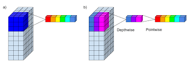
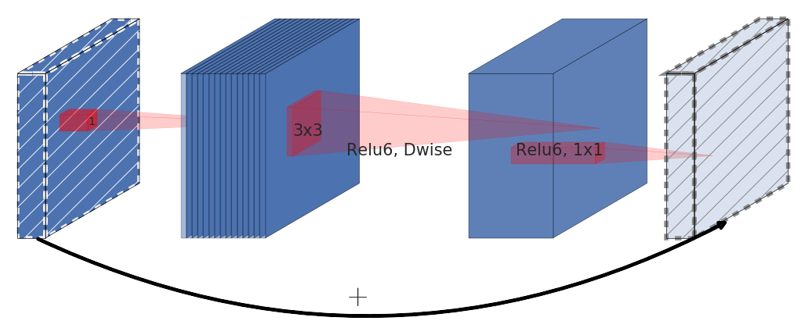
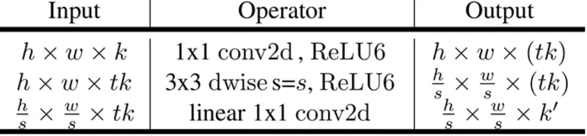
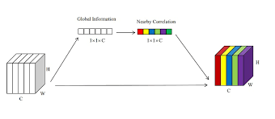
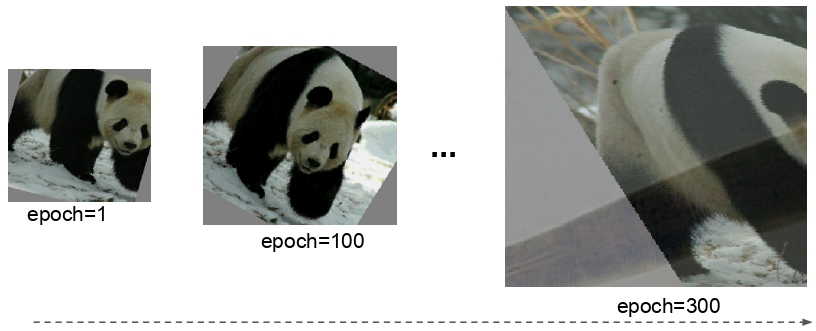
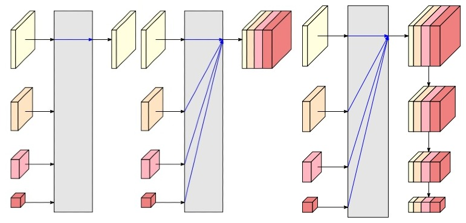

# 1/ Introduction:

Hello and welcome to my blog post on famous variants of convolutional neural networks (CNNs)! If you're reading this, chances are you're just as passionate about deep learning and computer vision as I am. CNNs are an integral part of the field, and have been responsible for some of the most impressive breakthroughs in image classification and object recognition. In this post, I'll be introducing you to some of the most famous CNNs that have been developed over the years and discussing their unique characteristics and contributions to the field. Whether you're a seasoned deep learning practitioner or just starting out, I hope this post will inspire you to dive deeper into the world of CNNs and learn more about how they work. So without further ado, let's get started!

# 2/ Famous network:

## 2.6 MobileNet

The MobileNet model is a convolutional neural network (CNN) developed by Google specifically for mobile devices. It was designed to be small, efficient, and fast, making it well-suited for use on mobile devices with limited computational resources.

One of the key innovations of the MobileNet model is the use of depthwise separable convolutions, which allow the model to learn more efficient and compact networks. 

In a standard convolutional layer, the filters are applied to the input feature maps in a sliding window fashion, with the output being a weighted sum of the values in the input window. This process is repeated for every location in the input feature maps to produce the output feature maps.

In a depthwise separable convolution, the filters are applied to the input feature maps in a different way. Instead of applying a single filter to the entire input feature maps, a separate filter is applied to each channel (or "depth") in the input feature maps. This process is known as a "depthwise" convolution.

After the depthwise convolution, a second convolution is applied a 1x1 convolution to the output of the depthwise convolution, using a set of filters that are shared across all the channels (or "depths") of the input to scale the depth of the feature map. This process is known as the "pointwise" convolution.

**Figure 1** Depthwise Convolution Layer. [Source](https://www.paepper.com/blog/posts/depthwise-separable-convolutions-in-pytorch/depthwise-separable-convolution.png)

The depthwise separable convolution allows the model to learn more efficient and compact networks, as the number of parameters and the computational cost are significantly reduced. It also allows the model to learn more complex features, as the depthwise convolution allows the model to learn features that are specific to each channel, while the pointwise convolution allows the model to combine these features in a more flexible way.

MobileNetV2, introduces an inverted residual block, which is essentially a inversed version of the residual block using depthwise separable convolution layer. This block applies a linear bottleneck transformation before and after the depthwise convolution operation. The linear bottleneck transformation in an inverted residual block refers to the use of a 1x1 convolution layer with a small number of filters before and after the depthwise convolution operation. 

A traditional residual block has a structure where the input has a high number of channels, which is first compressed using a 1x1 convolution to reduce the number of channels. Then, the number of channels is increased again with another 1x1 convolution, and the output of the block is the sum of the input and the output of the second 1x1 convolution. Inverted residual blocks, on the other hand, have a structure that first widens the input with a 1x1 convolution, then uses a 3x3 depthwise convolution to greatly reduce the number of parameters. Finally, the number of channels is reduced again with another 1x1 convolution, and the output of the block is the sum of the input and the output of the second 1x1 convolution. 

**Figure 2** Inverted Residual Block. [Source](https://arxiv.org/abs/1801.04381v4)

This design comes from a premise that non-linear activations result in information loss, means that applying non-linear transformations to the feature maps can reduce the amount of information that is preserved. The ReLU activation function is widely used in neural networks because it can increase the representational complexity of the network. However, it can also result in information loss if the activation collapses certain channels. In this case, the information in that channel is lost and cannot be recovered.

However, if the network has a large number of channels, it's possible that the information lost in one channel can still be preserved in other channels. If the input manifold can be embedded into a lower-dimensional subspace of the activation space, then the ReLU transformation can preserve the information while still introducing the needed complexity into the set of expressible functions.

Also, to preserve most of needed information, it's important that the input and output of inverted residual block are obtained via a linear transformation. In other words, we **do not** use the non-linear ReLU activation function on the final 1x1 convolution that maps back to low-dimensional space.

**Figure 3** Representation of the inverted residual layer. [Source](https://arxiv.org/abs/1801.04381v4)

## 2.7 SENet

The Squeeze-and-Excitation (SE) network is a convolutional neural network (CNN) that was developed to improve the performance of CNNs on image classification tasks. It was introduced in the paper "Squeeze-and-Excitation Networks" by Jie Hu, Li Shen, and Gang Sun in 2018.

The main idea behind the SE network is to use a "squeeze" operation to reduce the spatial dimensions (height and width) of the input feature maps, and an "excitation" operation to re-scale the feature maps based on their relative importance. The squeeze operation is implemented using a global average pooling layer, which reduces the spatial dimensions of the input feature maps and outputs a vector of summary statistics. The excitation operation is implemented using a fully connected (FC) layer and a sigmoid activation function, which re-scales the input feature maps based on their relative importance.

Global average pooling is a type of pooling operation that is used in convolutional neural networks (CNNs). It is a method of down-sampling the spatial dimensions (height and width) of the input feature maps, while retaining the depth (number of channels).

In global average pooling, the input feature maps are first passed through a pooling layer, which applies a function (such as the average or the maximum) to each patch of the feature maps. The output of the pooling layer is a set of summary statistics that describe the features in each patch.The global average pooling layer then takes the summary statistics and reduces the spatial dimensions of the input feature maps by taking the average value over the entire spatial dimensions. This produces a single value for each channel in the input feature maps, which can then be passed to the next layer of the network.

The excitation operation then applies a fully connected layer (also called a dense layer) to the output of the squeeze operation, followed by a sigmoid activation function. This produces a set of channel-wise weights that are used to adjust the importance of each channel in the input feature maps. In this way, it plays a similar role as the famous attention mechanism.

People may wonder why we use the Sigmoid function. The sigmoid function is used in the excitation operation because it produces a set of channel-wise weights that are used to adjust the importance of each channel in the input feature maps. These weights are not mutually exclusive, as they can have values between 0 and 1, which means that it can be interpreted as a probability that represents the importance of a channel. The sigmoid function is appropriate for this purpose because it maps its input to a value between 0 and 1, which makes it easy to interpret the output as a probability.

Other function, like the softmax function, on the other hand, is typically used in the final output layer of a neural network to produce a probability distribution over the classes. These probabilities are mutually exclusive, as each class can have a probability between 0 and 1, and the sum of the probabilities should be 1.

**Figure 4** Squeeze-And-Excitation Block. [Source](https://www.google.com/url?sa=i&url=https%3A%2F%2Farxiv.org%2Fpdf%2F1901.01493&psig=AOvVaw1slGS1lT-Bg71WfHyT-o1X&ust=1674493084723000&source=images&cd=vfe&ved=0CBAQjRxqFwoTCODRhYXT2_wCFQAAAAAdAAAAABAh)

Finally, the input feature maps are multiplied element-wise by the channel-wise weights to produce the output of the SE block. This process allows the network to focus on the most important channels and suppress the less important ones, resulting in a more robust and accurate representation of the input.

The SE network can be incorporated into any CNN by adding the squeeze and excitation operations to the intermediate layers of the network. It has been shown to improve the performance of CNNs on a variety of image classification tasks and has been widely adopted in the field of computer vision.

Overall, the SE network is a powerful tool for improving the performance of CNNs on image classification tasks, and has had a significant impact on the field of computer vision.

## 2.8/ EfficientNet:

EfficientNet is a convolutional neural network (CNN) architecture that has been designed to improve upon previous state-of-the-art models by increasing the model's capacity while also reducing the number of parameters and computational cost. The EfficientNet architecture is achieved through a combination of techniques such as compound scaling, which adjusts the resolution, depth, and width of the network in a systematic and principled manner, and the use of a mobile inverted bottleneck (MBConv) block, which is a more efficient version of the standard inverted bottleneck block.

The study found that a good balance between the width, depth, and resolution of the network is important for the model's performance. And that this balance can be achieved by proportionally adjusting the width, depth, and resolution with the same scaling factor. The author also provided an example of how to increase the computational resources used by the network by a factor of $2^N$. The method proposed in this statement is to increase the network depth, width, and image size simultaneously with a scaling factor that is determined by a small grid search on the original small model. The idea is to use three different constant coefficients, $\alpha$, $\beta$, and $\gamma$, such that $\alpha \cdot \beta^2 \cdot \gamma^2 \approx 2\alpha$ $\alpha \geq 1, \beta \geq 1, \gamma \geq 1$ to scale the depth, width, and image size respectively. These coefficients are determined by a small grid search on the original small model, which means that a small range of values for each coefficient is tested, and the best coefficients are selected based on the model's performance. For example, if we want to use 8 times more computational resources ($N=3$), then we can increase the network depth by $α^3$, width by $β^3$ and image size by $γ^3$. This will increase the computational resources used by the network by a factor of $2^3 = 8$.

The authors developed their baseline network by using a multi-objective neural architecture search (NAS) that aims to optimize both accuracy and FLOPS (floating point operations per second). The main building block is mobile inverted bottleneck from MobileNetV2, combined with squeeze-and-excitation optimization.

The EfficientNetV2 is similar to the original EfficientNet, but it uses a upgraded neural architecture search (NAS) to find the baseline architecture. The NAS framework used in EfficientNetV2 is based on previous NAS works and aims to jointly optimize accuracy, parameter efficiency, and training efficiency on modern accelerators. The search space used in EfficientNetV2 is a stage-based factorized space that consists of design choices for convolutional operation types, number of layers, kernel size, and expansion ratio. The search space is also reduced by removing unnecessary search options and reusing the same channel sizes from the backbone. The search reward used in EfficientNetV2 combines the model accuracy, normalized training step time, and parameter size using a simple weighted product. The goal is to balance the trade-offs between accuracy, efficiency, and parameter size.

A mechanism named Progressive Learning is also introduced in EfficientNetV2 to gradually increase the resolution of the input images during training. The idea behind this technique is that it allows the model to learn the low-level features of the input images first, and then gradually increase the resolution to learn more complex features. This can make the training process more efficient and help the model converge faster. In practice, Progressive Learning is implemented by starting with low-resolution images and increasing the resolution over time. This can be done by progressively increasing the resolution coefficient, which controls the resolution of the input images. The progressive learning also help to reduce the overfitting that can happen when training a model on high resolution images. By starting with low-resolution images, the model can learn general features that are applicable to all resolutions, and then fine-tune these features as the resolution increases.

**Figure 5** Progressive Learning Progress. [Source](https://arxiv.org/abs/2104.00298)

There is an observation that we should also adjust the regularization strength accordingly to different image sizes. Progressive Learning with adaptive Regularization was proposed to address this insight byy gradually increasing the complexity of the network while also adjusting the regularization strength. There are 3 types of regularization techniques used in EfficientNet: Dropout, RandAugment, Mixup.

**Figure 6** Mixup Augmentation Technique. [Source](https://arxiv.org/abs/2104.00298)

<!-- The intuition of the scaling logic comes from 2 observations: 

- "Scaling up any dimension of network
width, depth, or resolution improves accuracy, but the accuracy gain diminishes for bigger models". This statement is saying that increasing any dimension of the network (width, depth, or resolution) can improve the accuracy of the model, but that this improvement becomes less significant as the model becomes larger. In other words, when you increase the width, depth or resolution of the network, you are adding more parameters and computations to the model which in turn can improve the accuracy of the model, but as the model becomes larger, the accuracy gain from adding more parameters and computations becomes less significant. This is due to the fact that larger models are more prone to overfitting, and the incremental benefit of adding more parameters and computations becomes smaller.

- "In order to pursue better accuracy and efficiency, it is critical to balance all dimensions of network width, depth, and resolution during ConvNet scaling." This statement is emphasizing the importance of balancing the dimensions of network width, depth, and resolution when scaling up a convolutional neural network (ConvNet) in order to achieve better accuracy and efficiency. -->

<!-- One of the key advantages of EfficientNet is that it can achieve state-of-the-art performance on a number of image classification benchmarks while also being more computationally efficient than previous models. This means that EfficientNet can be used to train large and complex models while still being able to run on devices with limited computational resources, such as smartphones or embedded devices.

Another important aspect of EfficientNet is that it can be easily scaled to different datasets and tasks. This is achieved through the use of a compound scaling method, which allows the model to be scaled up or down in a systematic and principled manner. This means that EfficientNet can be used for a wide range of image classification tasks, from small datasets to large-scale datasets, without the need for significant modifications to the model architecture. -->

Overall, EfficientNet is a powerful and versatile CNN architecture that has the potential to revolutionize the way we train and deploy large and complex models. Its ability to achieve state-of-the-art performance while also being computationally efficient makes it an ideal choice for a wide range of image classification tasks, from small datasets to large-scale datasets.

## 2.9 HRNet:

HRNet, short for High-Resolution Network, is a state-of-the-art deep learning model for image understanding tasks such as object detection, semantic segmentation, and human pose estimation. It was first introduced by a team of researchers at the Multimedia Laboratory of the Chinese University of Hong Kong led by Dr. Ke Sun. 

Before HRNet was published, the process of high-resolution recovery was typically achieved through the use of architectures such as Hourglass, SegNet, DeconvNet, U-Net, SimpleBaseline, and encoder-decoder networks. These architectures used a combination of upsampling and dilated convolutions to increase the resolution of the representations outputted by a classification or classification-like network. HRNet aims to improve upon these previous methods by introducing a new architecture that is specifically designed to learn high-resolution representations.

The observation that led to the idea of HRNet is that the existing state-of-the-art methods for these position-sensitive vision problems adopted the high-resolution recovery process to raise the representation resolution from the low-resolution representation outputted by a classification or classification-like network, which leads to loss of spatial precision. The researchers behind HRNet noticed that maintaining high-resolution representations throughout the entire process could potentially lead to more spatially precise representations and ultimately improve performance on these position-sensitive tasks.

The authors of the paper proposed a novel architecture that allows for the maintenance of high-resolution representations throughout the whole process. The network is composed of multiple stages, each stage contains multiple streams that correspond to different resolutions. The network performs repeated multi-resolution fusions by exchanging information across the parallel streams, allowing for the preservation of high-resolution information, and repeating multi-resolution fusions to boost the high-resolution representations with the help of the low-resolution representations.

**Figure 7** Traditional High Resolution Revovery (Above) Vs HRNet (Below). [Source](https://arxiv.org/abs/1908.07919)

HRNet maintain high-resolution representations throughout the network by starting with a high-resolution convolution stream as the first stage, and gradually adding high-to-low resolution streams one by one, forming new stages. The parallel streams at each stage consist of the resolutions from the previous stage, and an extra lower one, which allows for multi-resolution fusions and the ability to maintain high-resolution representations throughout the network. This architecture is called Parallel Multi-Resolution Convolutions.

Repeated Multi-Resolution Fusions is a technique used in the HRNet architecture to fuse representations from different resolution streams. This is done by repeatedly applying a transform function on each resolution stream, that is dependent on the input resolution index $x$ and the output resolution index r. The transform function is used to align the number of channels between the high-resolution and low-resolution representations. If the output resolution index ($r × r$) is lower than the input resolution index ($x × x$), the transform function ($f_{r}(·)$) downsamples the input representation (R) through $(r - x)$ stride-2 $3 × 3$ convolutions. For example, one stride-2 $3 × 3$ convolution for 2× downsampling, and two consecutive stride-2 $3 × 3$ convolutions for 4× downsampling. If the output resolution is higher than the input resolution, the transform function is upsampling the input representation $R$ through the bilinear upsampling followed by a $1 × 1$ convolution for aligning the number of channels.

**Figure 8** The representation head of HRNetV1, HRNetV2, HRNetV2p. [Source](https://arxiv.org/abs/1908.07919)

The resulting network is called HRNetV1, which is mainly applied to human pose estimation and achieves state-of-the-art results on COCO keypoint detection dataset. HRNetV2, on the other hand, combines the representations from all the high-to-low resolution parallel streams and is mainly applied to semantic segmentation, achieving state-of-the-art results on PASCAL-Context, Cityscapes, and LIP datasets. HRNetV2p is an extension of HRNetV2, which construct a multi-level representation and is applied to object detection and joint detection and instance segmentation. It improves the detection performance, particularly for small objects.

# Conclusion:

Overall, this blog post aimed to provide an intuitive understanding of famous CNN architectures and techniques, and how they can be used to improve the performance of CNNs. These architectures and techniques have been proven to be highly effective in a wide range of image classification tasks and are widely used in modern deep learning applications.

Part 2 of this blog has explored the various architectures and techniques used in modern CNNs to improve their performance. In part 3 of this blog, we will delve deeper into other architectures that are less known but being used in various modern CNNs and explore their specific use cases and advantages.