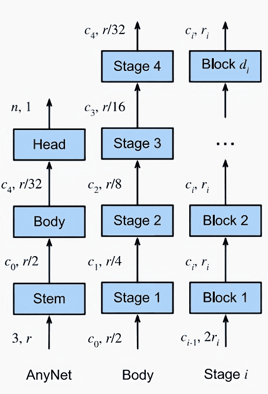

# Introduction:

Convolutional Neural Networks (CNNs) have revolutionized the world of computer vision and deep learning, allowing us to solve complex tasks with remarkable accuracy. From identifying objects in images to recognizing speech, CNNs have become an indispensable tool for data scientists and researchers. However, despite their widespread use, the design space of CNNs is often shrouded in mystery and considered to be a black box by many. In this blog, we aim to demystify this design space and shed light on the common elements that make up a typical CNN. Join us on this journey as we delve into the inner workings of CNNs and explore the underlying principles that make them so powerful.

# Design Pattern 

The common design pattern for Convolutional Neural Networks (CNNs) are divided into three main components: the stem, the body, and the head. 

The stem performs initial image processing and often uses convolutions with a larger window size. The body is made up of multiple blocks and carries out the majority of transformations needed to turn raw images into object representations. The head then converts these representations into the desired outputs, such as via a softmax regressor for multiclass classification.

The stem's initial image processing is crucial for reducing noise and removing irrelevant information from the input data. The body's multiple blocks and stages are responsible for extracting features and transforming the data into a useful representation. The head's output prediction is based on the features extracted by the body and must be optimized for the specific task being performed.

The body is further divided into multiple stages, which operate on the image at decreasing resolutions. Both the stem and each subsequent stage quarter the spatial resolution of the image. Each stage consists of one or more blocks.



**Figure 1** The CNN design space. The numbers (c, r) along each arrow indicate the number of channels c and the resolution r × r of the images at that point. From left to right: generic network structure composed of stem, body, and head; body composed of four stages; detailed structure of a stage

Let's take a look at Figure 1. The stem part takes as input the RGB image which has 3 channel and transform them into a feature maps with $c_0$ channels. It also halves the resolution $r\times r$ to $r/2\times r/2$. There are 2 common ways to halve the resolution of a feature map in a Convolutional Neural Network (CNN) and we can see the difference between different implementations. The first one is using pooling layer; it works by down-sampling the feature maps by taking the maximum or average value of the pixels within a set window size. Another way to reduce the resolution of feature maps is through the use of convolution layers with a stride of 2. This method applies the convolution operation to every other pixel in the feature map, effectively reducing the spatial dimension by half. This method has the advantage of retaining more information compared to pooling layers, as it doesn't perform any lossy operations.


**Figure 2** Common CNN design space visualized on Resnet. The stem part consists of 2 convolution layer. The body contains 4 stages which have 3,4,6,3 blocks, respectively. The head is a fully connected layer.

Assumed our image is compatible with ImageNet images of shape $224\times224$, the body part of the CNN serves to decrease the spatial dimensions of the image to $7\times7\times c_4$ through four stages. Each stage has a stride of 2, which means that it reduces the spatial resolution by half. As a result, the resolution of the image is reduced from $224\times224$ to $7\times7$ over the course of these four stages. This is achieved by dividing the initial size by 2 five times, resulting in the final size of $224/2^{5} = 7$.

Each stage in the body of a Convolutional Neural Network (CNN) is composed of multiple blocks. These blocks can have the same number of channels, as seen in the VGG network. Alternatively, the number of channels in the middle block of a stage can be smaller, resulting in a bottleneck structure. This design choice allows for more efficient computation while maintaining a similar level of performance. Another option is to have the middle block of a stage have a higher number of channels, referred to as an inverted bottleneck structure. It should be mentioned that, regardless of the structure chosen for the blocks within a stage, the first and last blocks in each stage always have the same number of channels.

The last component - the head of the network - adopts a standard design, utilizing global average pooling to condense the feature maps into a compact representation. This is then followed by a fully connected layer, which outputs an n-dimensional vector.

When manually designing a custom CNN architecture, various hyperparameters must be selected. One of the most crucial decisions is the type of blocks to be used in each stage. There are a variety of pre-existing blocks to choose from, such as VGG blocks, Inception blocks, or ResNet blocks. Alternatively, one may choose to design a custom block manually. Another option is to use Neural Architecture Search (NAS), though this will not be discussed in detail here. 

In case of using bottleneck layer or inverted bottleneck layer, we will need to choose the bottleneck ratio. It refers to the ratio of the number of channels in a bottleneck layer within a convolutional block compared to the number of channels in the input and output of the block. As such, with bottleneck ratio $k_i$ ≥ 1 we afford some number of channels $c_i/k_i$ within each middle block for stage $i$. Additionally, some blocks such as ResNeXt and MobileNet's blocks can use group convolution, where the input channels are divided into multiple groups and each group is convolved independently with its own set of filters. In that case, we also need to choose their group width. 

For short, we will consider the type of CNN block, the number of stages $m$, the number of blocks in each stage $d_1$,$d_2$,...,$d_m$, the channels of each stage $c_1$,$c_2$,...,$c_m$, the bottleneck ratios $k_1$,$k_2$,...,$k_m$ as well as the group width $g_1$,$g_2$,...,$g_m$.

# Implementation:

This section provides the implementation of AnyNet -  the template for this kind of CNN design space. The first thing to do is defining our architecture's hyperparameter with a dictionary `params`. The specific hyperparameters chosen here correspond to a CNN with a bottleneck block type, 4 stages, 2 blocks per stage in the first and last stages and 4 blocks per stage in the intermediate stages, with channel sizes ranging from 32 to 512, a bottleneck ratio of 4, and a group width of 32.

```python
import os

import torch
import torch.nn as nn
import torch.nn.functional as F
import torch.optim as optim
from torch.utils.data import DataLoader, random_split

import pytorch_lightning as pl
from pytorch_lightning.callbacks import LearningRateMonitor, ModelCheckpoint
from torchvision import transforms
from torchvision.datasets import CIFAR10

params = {
    'block_type': 'bottleneck', # 'bottleneck', 'vgg', 'inception'
    'num_stages': 4,
    'num_blocks_per_stage': [2, 4, 4, 2],
    'num_channels': [32, 64, 128, 256, 512],
    'bottleneck_ratio': 4,
    'group_width': 32
}
```

We also define 3 types of convolutional block, namely ResNet BottleNeck, VGG and Inception. For BottleNeck block, the convolutional layers are applied on the input x in the order conv1 -> bn1 -> relu -> conv2 -> bn2 -> relu -> conv3 -> bn3. The shortcut connection is added to the output of this sequence of layers, and the resulting tensor is passed through a final ReLU activation. The shortcut consists of a sequence of 1x1 convolutions and batch normalization layers.

VGG consists of a convolutional layer followed by a batch normalization layer and a ReLU activation function. Optionally, it can also have a max pooling layer with a kernel size of 2 and a stride of 2. The pooling layer downsamples the input tensor by a factor of 2 in both spatial dimensions.

Inception block applies four different convolutional operations with different kernel sizes (1x1, 3x3, 5x5) as well as a pooling operation. The outputs of these operations are concatenated along the channel dimension and returned as the output of the block.

```python
class Bottleneck(nn.Module):
    def __init__(self, in_planes, planes, expansion, group_width, stride=1):
        super(Bottleneck, self).__init__()
        self.expansion = expansion
        self.group_width = group_width
        self.conv1 = nn.Conv2d(in_planes, planes, kernel_size=1, bias=False, groups=self.group_width)
        self.bn1 = nn.BatchNorm2d(planes)
        self.conv2 = nn.Conv2d(planes, self.expansion * planes, kernel_size=3, stride=stride, padding=1, bias=False, groups=self.group_width)
        self.bn2 = nn.BatchNorm2d(self.expansion * planes)
        self.conv3 = nn.Conv2d(self.expansion * planes, planes, kernel_size=1, bias=False, groups=self.group_width)
        self.bn3 = nn.BatchNorm2d(planes)

        self.shortcut = nn.Sequential()
        if stride != 1 or in_planes != planes:
            self.shortcut = nn.Sequential(
                nn.Conv2d(in_planes, planes, kernel_size=1, stride=stride, bias=False),
                nn.BatchNorm2d(planes)
            )

    def forward(self, x):
        out = F.relu(self.bn1(self.conv1(x)))
        out = F.relu(self.bn2(self.conv2(out)))
        out = self.bn3(self.conv3(out))
        out += self.shortcut(x)
        out = F.relu(out)
        return out

class VGGBlock(nn.Module):
    def __init__(self, in_channels, out_channels, kernel_size=3, padding=1, pooling=False):
        super(VGGBlock, self).__init__()
        self.conv = nn.Conv2d(in_channels, out_channels, kernel_size, padding=padding)
        self.bn = nn.BatchNorm2d(out_channels)
        self.relu = nn.ReLU(inplace=True)
        self.pooling = pooling
        if self.pooling:
            self.pool = nn.MaxPool2d(kernel_size=2, stride=2)
    
    def forward(self, x):
        x = self.conv(x)
        x = self.bn(x)
        x = self.relu(x)
        if self.pooling:
            x = self.pool(x)
        return x

class InceptionBlock(nn.Module):
    def __init__(self, in_channels, out_channels_1x1, out_channels_3x3_reduce, out_channels_3x3, out_channels_5x5_reduce, out_channels_5x5, out_channels_pool_proj):
        super(InceptionBlock, self).__init__()

        self.branch_1x1 = nn.Sequential(
            nn.Conv2d(in_channels, out_channels_1x1, kernel_size=1),
            nn.BatchNorm2d(out_channels_1x1),
            nn.ReLU(inplace=True)
        )

        self.branch_3x3 = nn.Sequential(
            nn.Conv2d(in_channels, out_channels_3x3_reduce, kernel_size=1),
            nn.BatchNorm2d(out_channels_3x3_reduce),
            nn.ReLU(inplace=True),
            nn.Conv2d(out_channels_3x3_reduce, out_channels_3x3, kernel_size=3, padding=1),
            nn.BatchNorm2d(out_channels_3x3),
            nn.ReLU(inplace=True)
        )

        self.branch_5x5 = nn.Sequential(
            nn.Conv2d(in_channels, out_channels_5x5_reduce, kernel_size=1),
            nn.BatchNorm2d(out_channels_5x5_reduce),
            nn.ReLU(inplace=True),
            nn.Conv2d(out_channels_5x5_reduce, out_channels_5x5, kernel_size=5, padding=2),
            nn.BatchNorm2d(out_channels_5x5),
            nn.ReLU(inplace=True)
        )

        self.branch_pool = nn.Sequential(
            nn.MaxPool2d(kernel_size=3, stride=1, padding=1),
            nn.Conv2d(in_channels, out_channels_pool_proj, kernel_size=1),
            nn.BatchNorm2d(out_channels_pool_proj),
            nn.ReLU(inplace=True)
        )

    def forward(self, x):
        x1 = self.branch_1x1(x)
        x2 = self.branch_3x3(x)
        x3 = self.branch_5x5(x)
        x4 = self.branch_pool(x)

        return torch.cat([x1, x2, x3, x4], dim=1)
```

Next, we wrap them up into an AnyNet module. It includes a stem block, four stages of feature extraction blocks, and a head block for classification. The specific blocks used in each stage can be specified by the user, including options for bottleneck blocks, VGG-style blocks, and inception blocks. In this implementation, we provide a classification module and test its capacity on the well-known CIFAR10 dataset. However, everyone can easily adapt another head part to use it on other vision tasks. 

```python
class AnyNet(nn.Module):
    def __init__(self, params):
        super(AnyNet, self).__init__()
        self.params = params
        self.block_type = params['block_type']
        self.num_stages = params['num_stages']
        self.num_blocks_per_stage = params['num_blocks_per_stage']
        self.num_channels = params['num_channels']
        self.bottleneck_ratio = params['bottleneck_ratio']
        self.group_width = params['group_width']

        self.in_planes = self.num_channels[0]

        # self.conv1 = nn.Conv2d(3, self.in_planes, kernel_size=3, stride=1, padding=1, bias=False)
        # self.bn1 = nn.BatchNorm2d(self.in_planes)
        self.stem = nn.Sequential(
            nn.Conv2d(3, self.in_planes, kernel_size=3, stride=1, padding=1, bias=False),
            nn.BatchNorm2d(self.in_planes),
            nn.ReLU(inplace=True)
        )
        
        self.layer1 = self._make_layer(self.num_blocks_per_stage[0], stage_id=1, expansion=params['bottleneck_ratio'], group_width=params['group_width'])
        self.layer2 = self._make_layer(self.num_blocks_per_stage[1], stage_id=2, expansion=params['bottleneck_ratio'], group_width=params['group_width'], stride=2)
        self.layer3 = self._make_layer(self.num_blocks_per_stage[2], stage_id=3, expansion=params['bottleneck_ratio'], group_width=params['group_width'], stride=2)
        self.layer4 = self._make_layer(self.num_blocks_per_stage[3], stage_id=4, expansion=params['bottleneck_ratio'], group_width=params['group_width'], stride=2)

        # self.linear = nn.Linear(self.in_planes, 10)
        self.head = nn.Sequential(
            nn.AdaptiveAvgPool2d((1, 1)),
            nn.Flatten(),
            nn.Linear(self.num_channels[-1], 10)
        )

    def _make_layer(self, num_blocks, stage_id, expansion, group_width, stride=1):
        strides = [stride] + [1] * (num_blocks - 1)
        layers = []
        for stride in strides:
            if self.block_type == 'bottleneck':
                layers.append(Bottleneck(self.in_planes, self.num_channels[stage_id], expansion, group_width, stride))
            elif self.block_type == 'vgg':
                layers.append(VGGBlock(self.in_planes, self.num_channels[stage_id], pooling=(stride == 2)))
            elif self.block_type == 'inception':
                layers.append(InceptionBlock(self.in_planes, self.num_channels[stage_id] // 4, 
                                             self.num_channels[stage_id] // 2, self.num_channels[stage_id] // 2, 
                                             self.num_channels[stage_id] // 2, self.num_channels[stage_id] // 8, self.num_channels[stage_id] // 8))
            self.in_planes = self.num_channels[stage_id]
        return nn.Sequential(*layers)

    def forward(self, x):
        x = self.stem(x)
        x = self.layer1(x)
        x = self.layer2(x)
        x = self.layer3(x)
        x = self.layer4(x)
        
        x = self.head(x)
        return x
```

We use the Pytorch Lightning framework in order to format our implementation.

```python
class CIFARModule(pl.LightningModule):
    def __init__(self, model_hparams):
        """
        Inputs:
            model_hparams - Hyperparameters for the model, as dictionary.
        """
        super().__init__()
        # Exports the hyperparameters to a YAML file, and create "self.hparams" namespace
        self.save_hyperparameters()
        # Create model
        self.hparams.model_hparams = model_hparams
        
        self.model = AnyNet(self.hparams.model_hparams)
        # Create loss module
        self.loss_module = nn.CrossEntropyLoss()
        # Example input for visualizing the graph in Tensorboard
        self.example_input_array = torch.zeros((1, 3, 224, 224), dtype=torch.float32)

    def forward(self, imgs):
        # Forward function that is run when visualizing the graph
        return self.model(imgs)

    def configure_optimizers(self):
        # We will support Adam or SGD as optimizers.
        if self.hparams.optimizer_name == "Adam":
            # AdamW is Adam with a correct implementation of weight decay (see here
            # for details: https://arxiv.org/pdf/1711.05101.pdf)
            optimizer = optim.AdamW(self.parameters(), **self.hparams.optimizer_hparams)
        elif self.hparams.optimizer_name == "SGD":
            optimizer = optim.SGD(self.parameters(), **self.hparams.optimizer_hparams)
        else:
            assert False, f'Unknown optimizer: "{self.hparams.optimizer_name}"'

        # We will reduce the learning rate by 0.1 after 100 and 150 epochs
        scheduler = optim.lr_scheduler.MultiStepLR(optimizer, milestones=[100, 150], gamma=0.1)
        return [optimizer], [scheduler]

    def training_step(self, batch, batch_idx):
        # "batch" is the output of the training data loader.
        imgs, labels = batch
        preds = self.model(imgs)
        loss = self.loss_module(preds, labels)
        acc = (preds.argmax(dim=-1) == labels).float().mean()

        # Logs the accuracy per epoch to tensorboard (weighted average over batches)
        self.log("train_acc", acc, on_step=False, on_epoch=True)
        self.log("train_loss", loss)
        return loss  # Return tensor to call ".backward" on

    def validation_step(self, batch, batch_idx):
        imgs, labels = batch
        preds = self.model(imgs).argmax(dim=-1)
        acc = (labels == preds).float().mean()
        # By default logs it per epoch (weighted average over batches)
        self.log("val_acc", acc)

    def test_step(self, batch, batch_idx):
        imgs, labels = batch
        preds = self.model(imgs).argmax(dim=-1)
        acc = (labels == preds).float().mean()
        # By default logs it per epoch (weighted average over batches), and returns it afterwards
        self.log("test_acc", acc)
```

The comprehensive trainging and testing code on CIFAR10 can also be found in this [notebook](https://colab.research.google.com/drive/1VHs30ePx0WgZ6p4MterdcLxJBi70r6Tg?usp=sharing). You may want to take a look at the notebook and experiment with the code to gain a deeper understanding of how the AnyNet architecture works and how it can be trained on the CIFAR-10 dataset.

# Discussion

In this blog post, we have provided an overview of the AnyNet architecture and its key components, as well as an implementation of the AnyNet model using PyTorch. We have also demonstrated how to train and evaluate the model on the CIFAR-10 dataset. Additionally, note that while we have covered the intuition and implementation of AnyNet, there is still another important aspect of designing neural networks: choosing hyperparameters and defining a search space for the internal architecture of the block. We will discuss this in more detail in a separate post.