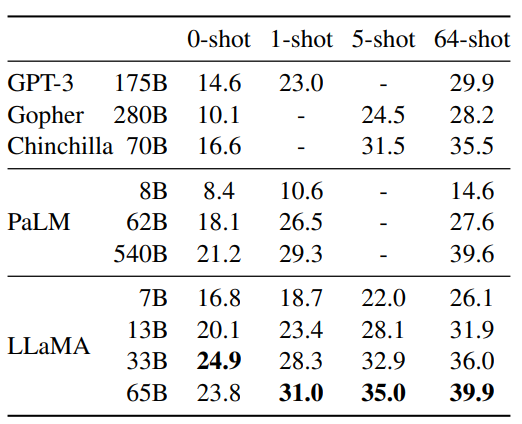

These days of early 2023, ChatGPT has marked a watershed moment in the history of artificial intelligence, gained widespread popularity and acceptance around the world, thanks to its ability to understand and generate human-like responses to a wide range of prompts. More and more of research attention were put on GPT3 - the underlying architecture that is the driving force behind ChatGPT.

However, just when we thought GPT-3 was the pinnacle of language modeling, a new game-changing model has arrived on the scene. Facebook has recently released a new language model named LLama that has reportedly outperformed GPT-3 in several language benchmarks. 

# 1/ Key concepts:

LLaMA is the name of a series of language models, ranging from 7B to 65B parameters.

Train smaller models on larger dataset than what is typically used. Used only publicy available data.

The authors claim that LLaMA-13B outperforms GPT-3 on most benchmarks despite being 10x smaller. Furthermore, the 65B-parameter model is said to be competitive with the best large language models such as Chinchilla or PaLM-540B.

# 2/ Training data:

In many machine learning challenges, especially those related to computer vision, access to high-quality and diverse datasets can be a key factor in achieving high performance. If you are a follower of the challenges that do not restrict the use of dataset like "Google Universal Image Embedding" or "ImageNet Large Scale Visual Recognition Challenge", you could see teams that are able to gather and effectively use external data sources can often gain an advantage over teams that rely solely on the provided datasets.

The authors of this work have taken an interesting approach to training their language models. Rather than relying on proprietary or inaccessible datasets, they have trained their models exclusively on publicly available datasets.This approach could have significant implications for the field of language modeling. By relying on publicly available datasets, researchers and developers may be able to train powerful language models without the need for expensive proprietary datasets.

The main effort of the authors was creating large-scale language dataset relied on publicly available datasets:

- English CommonCrawl [67%]: This is a large corpus of web pages that are crawled and made available to the public for research purposes. The author preprocess five CommonCrawl dumps using the CCNet pipeline which includes deduplicating at the line level, performing language identification to remove non-English pages, filtering low quality content with an n-gram language model and a linear classification model. 

- C4 [15%]: Using the same preprocess pipeline like above, except using heuristic methods such as presence of punctuation marks or the number of words and sentences in a webpage.

- Github [4.5%]: They kept only projects that are distributed under the Apache, BSD and MIT licenses and filtered with some heuristics like  the line the length or proportion of alphanumeric characters.

- Wikipedia [4.5%]: They added posts from the June-August 2022 period.

- Gutenberg and Books3 [4.5%]:  The authors of the LLaMA paper included two book corpora in their training dataset: the Gutenberg Project and the Books3 section of ThePile. The Gutenberg Project contains books that are in the public domain, while ThePile is a publicly available dataset that was created specifically for training large language models.

- ArXiv [2.5%]: The authors removed everything before the first section of each paper, as well as the bibliography at the end. They also removed any comments that were included in the LaTeX source files, as well as any inline-expanded definitions and macros written by the authors of the papers.

**Figure 1**  Zero-shot performance on **Common Sense Reasoning** tasks.

- Stack Exchange [2%]: This is a popular website that hosts a large collection of high-quality questions and answers. The authors kept the data from the 28 largest websites, removed the HTML tags from the text, and sorted the answers by score, from highest to lowest.

They used Byte Pair Encoding (BPE) for tokenizing the texts. The algorithm works by iteratively merging the most frequent pairs of adjacent symbols (in this case, characters or character sequences) until a desired vocabulary size is reached.

# 3/ Architecture, training procedure:

- The LLaMA architecture leverages various improvements that were subsequently proposed and used in different models such as GPT-3(Pre-normalization), PaLM(SwiGLU activation function), and GPT-Neo(Rotary Embeddings).

- They also optimized the models with AdamW and cosine learning rate schedule.

- The authors make use of an efficient implementation of the causal multi-head attention to reduce memory usage and runtime by not storing the attention weights and not computing the key/query scores that are masked due to the causal nature of the language modeling task. This is avalable in the xformers library.

- Checkpointing technique is also used to reduce memory consumption. In checkpointing, intermediate activations of a network are saved periodically and only recomputed when necessary during the backward pass, instead of being stored in memory for the entire duration of training.

**Figure 2**  **NaturalQuestions**. Exact match performance.

# 4/ Experimental results:

These models have been evaluated using 2 commonly used methods: Zero-shot and few-shot tasks. Sometimes in other models, we can observe the use of other evaluation method like fine-tuning on a specific task, cross-validation, and measuring the perplexity of a model on a held-out dataset.

In the context of language model:

- Zero-shot tasks are tasks that the model has never been explicitly trained on, but it is expected to be able to perform well based on its general language understanding. The models were given a textual description of a task, providing the model with an understanding of what kind of task it needs to perform. The description typically includes a prompt that specifies what information is required to complete the task, as well as any constraints or specifications on the expected output. The model is expected to provide an answer using open-ended generation or rank the proposed answers without any fine-tuning on the specific task.

- In few-shot tasks, the model is given a small number of examples (usually between 1 and 64) of the task, and a test example. The model takes these examples as input and generates the answer or ranks different options.

The LAMA model was evaluated on a variety of benchmarks, including Common Sense Reasoning, Closed-book Question Answering, Reading Comprehension, Mathematical Reasoning, Code Generation, and Massive Multitask Language Understanding.

# 5/ Discussion:

Here we have some observations and insights of the authors:

-  Finetuning these models on instructions
lead to promising results.

-  In their experiments, the authors observe that toxicity scores increase with larger model sizes within the same model family.

- The model captured societal biases related to gender and occupation.

# Conclusion
Our brief paper review is ended here. We hope it can give you useful information and comprehensive understanding of this paper. So, let's continue exploring these breakthrough techniques and to remain dedicated to responsible and ethical research.